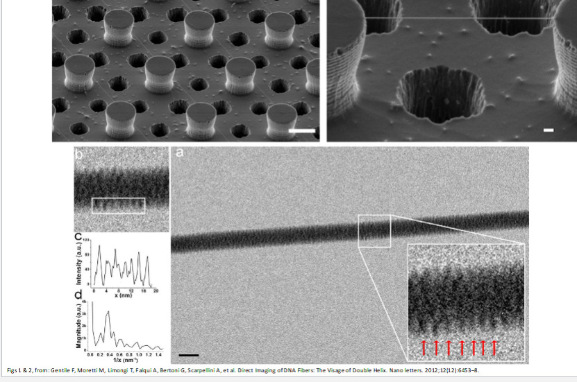
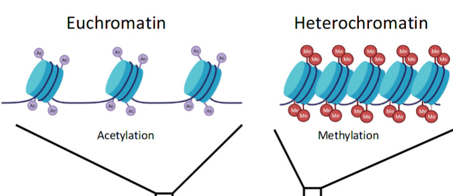
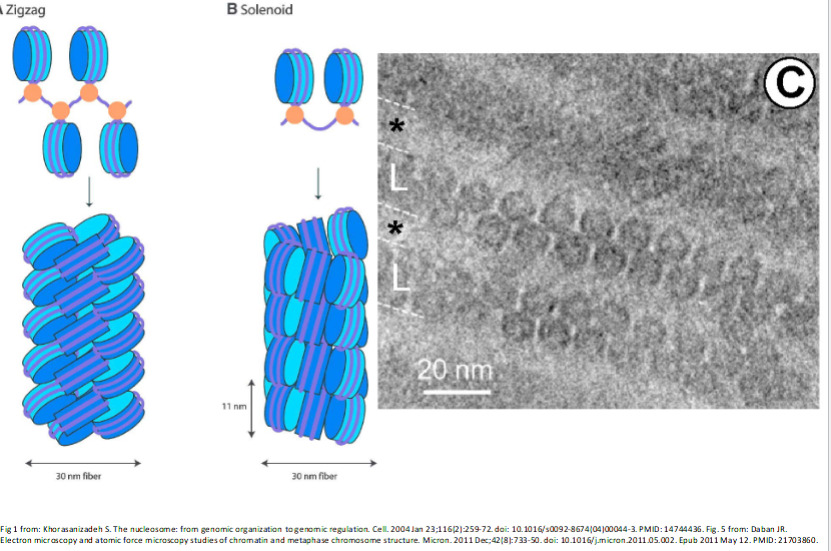



## TEP 327: Engineering and Law

Why do engineers need to know about law?  
- Engineering ends up stepping across a lot of jurisdictions, so we kinda need to know about it.

Law is ...
- very territorial: must note jurisdiction
  - Must develop intuition for jurisdiction (See [section 91]())
  - Generally:
    - Things outside of Canada & maintained *across* Canada -- Federal
    - Things that are managed within Canada and aren't necessarily consistent (local effect) -- Provincial
    - Things that Provincial gov. doesn't want to deal with -- Municipal (via mandate)
    - And for everything -- consider case law, etc.
- always dependent on context and subject to interpretation; the law's wording can stay constant but the interpretation can change over time
  - There are standard methods of interpretation (Living tree vs originalist, strict literal vs commercial reality/intentions)
  - Canada is bijural (both civil and common law)
    - Note difference between public (refers to society as a whole) and private law (individual interactions)

### Resources
- [Canadian Distribution of Legislative Powers](https://laws-lois.justice.gc.ca/eng/const/page-3.html)

## ECE286: Probability and Statistics

### Lecture 1

#### Coin flip example & combining probabilities

Outcomes denoted by variables, i.e. for coin clip \\( H \\), \\( T \\). Probability of outcome is denoted by \\( P(X) \\), where \\( X \\) is the outcome. We must have \\( \sum(P) = 1 \\) since \\( 100% \\).

Suppose \\( P(H) = 0.3 \\) , \\( P(T) = 0.7 \\). 

Then, $$P(HT) = P(H)P(T) = 0.3 \times 0.7 = 0.21 $$ 
$$ P(HT) = P(H)P(T) = 0.3 \times 0.7 = 0.21 $$
$$ P(HT \text{ or  } TH) = P(H)P(T) + P(T)P(H) = \\\\ 0.3 \times 0.7 + 0.7 \times 0.3 = 0.42 $$

#### Sets and events

**Sample space**: set of a\ell possible outcomes.
E.x. 
- coin flip: \\( S = {H, T} \\)
- roll of a die: \\( S = {1,2,3,4,5,6} \\)
- roll of a die but only care even/odd: \\( S = {even, odd} \\)

**Event**: a subset of sample space  

For example, each element, \\(e \in S = {1,2,3,4,5,6} \\) are the elements of S for a die.

**Complement of an event A w.r.t. S**: everything in \\( S \\) and not \\( A \\), denoted \\( A' \\).  
Example: for a die, \\( {1, 2} \\) is the complement of \\( {3,4,5,6} \\)

**Intersection of two events**: everything in \\( A \\) *and* \\( B \\), denoted \\( A \cap B \\)

**Union of two events**: everything in \\( A \\) *or* \\( B \\), denoted \\( A \cup B \\)

#### Counting

**Multiplication Rule**: 
The total amount of outcomes is the product of the amount of outcomes in each event.
I.e. if for a sequence if \\( k \\) events \\( E_1, E_2, ..., E_k \\) with outcomes \\( S_1, S_2, ..., S_k \\)
then the total amount of outcomes is \\( \prod_{i=1}^k S_i \\)

**Permutations**: \\( n \\) distinct objects can be arranged in \\( n! \\) ways. When considering permuting a subset of size \\( r \\) taken from a set of size \\( n \\), the total number of arrangements is given by 

$$ nPr = \frac{n!}{(n-r)!} $$

If we can have repeated kinds, i.e. if there are \\( m \\) kinds of items and \\( n_k, k = 1, \dots m \\) of each kind, then there are 

$$ \frac{n!}{n_1!n_2!\dots n_m!}$$ permutations.

For example, we can order "ATLANTIC" \\( \frac{8!}{2!2!1!1!1!1!}  = 10080\\) times.

The same formula applies for finding the number of ways to arrange \\( n \\) items into \\( k \\) subsets of size \\( n_1, n_2, \dots , n_k \\)

**Combinations**: Permutations, but order doesn't matter.

$$ nCr = \binom{n}{r} = \frac{n!}{r!(n-r)!} $$

Note similarity to the partition formula; combinations can be thought as the set of partitions of size \\( 1 \\).

## ECE259: Electromagnetism

Electromagnetic field is a vector quantity given by a magnitude \\( E \\) and unit vector \\( \hat{a} \\), and is commonly found as the force exerted on a positive test charge \\( q \\).

$$ \vec{E}= E\hat{a}_E = \frac{\hat{F}}{q} = q\vec{E}$$

We can expand on this to find the force exerted by a point charge at varying distances \\( r \\) from the charge, noting that \\( k = \frac{1}{4\pi E_o}\\), where \\( E_o \\) is the permittivity of free space.

$$ \vec{E} = \frac{1}{k} \frac{q_{source}}{r^2} \hat{a}_e $$

and this can be further generalized for a system of charges that are not necessarily at the origin

$$ \vec{}{E_{sys}} = \frac{1}{k}\sum_k \frac{q_k}{|\vec{R}-\vec{R'_k}|^3}(\vec{R} - \vec{R'_k}) $$

## BME205: Introduction to Biomedical Engineering

### Cells

#### Componennts

- **Lysosome**: 
- **Mitochondria**: 
- **Smooth Endoplasmic Reticulum**:
- **Nucleus**:
  - **Chromatin**:
  - **Nucleolus**:
  - **Nuclear pores**:
  - **Cisternae**: 

- **Ribosome**:
- **Endoplasmic Reticulum**:
- **Golgi Apparatus**:
- **Vesicle**:
- **Rough Endoplasmic Reticulum**:
- **Plasma Membrane**:
- **Vacuole**:

#### DNA & Chromosomes

DNA is built up of nucleotides, each of which has three components: a nitrogenous base, a five-carbon sugar *deoxyribose*, and a phosphate group. 
These are linked together by hydrogen bonds between bases, which is highly specific: *adenine (A)*: *thymine (T)*: *guanine (G)*: *cytosine (C)*.

> The above is direct imaging of DNA fibers; see how they can fit together!

Chromosomes are made of DNA that has been "super coiled" (think: telephone cord).

.

There are multiple ways that this can be packed, e.g. zigzag or solenoid patterns:

One can imagine that in a complicated system like this there can be knots and kinks and errors -- which is what can happen and lead to various complications e.g. cancer.

## PHY294: Quantum and Thermal Physics

## ESC204: Praxis III

