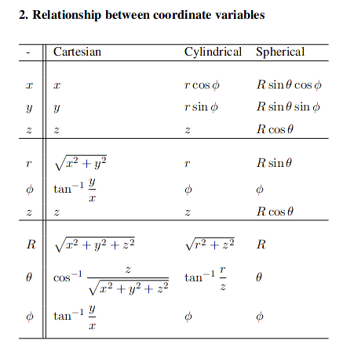
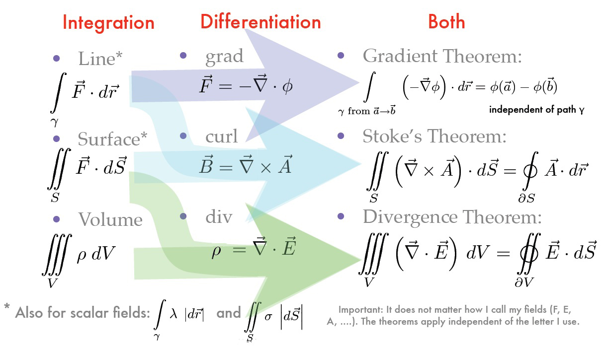
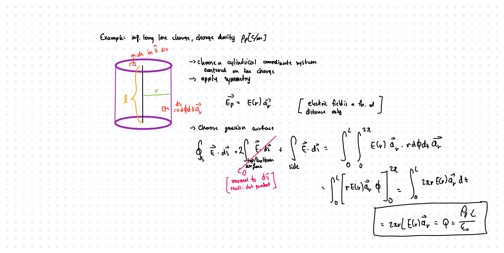
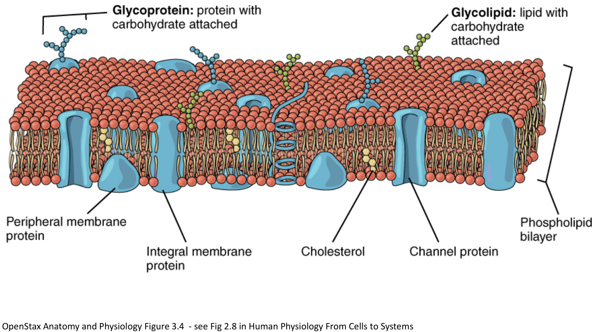
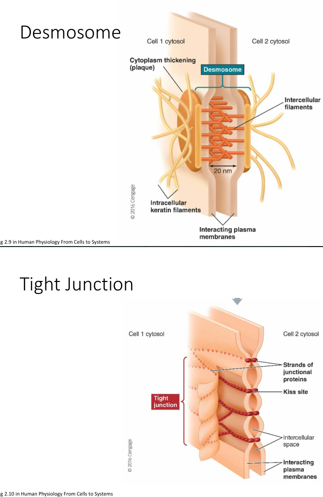
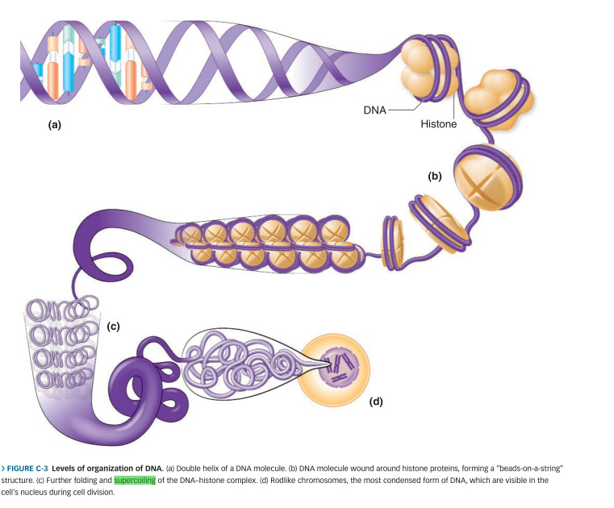

// Work in progress //

## ECE286: Probability and Statistics

### Probability

#### Coin flip example & combining probabilities

Outcomes denoted by variables, i.e. for coin clip \\( H \\), \\( T \\). Probability of outcome is denoted by \\( P(X) \\), where \\( X \\) is the outcome. We must have \\( \sum(P) = 1 \\) since \\( 100% \\).

Suppose \\( P(H) = 0.3 \\) , \\( P(T) = 0.7 \\). 

Then, $$P(HT) = P(H)P(T) = 0.3 \times 0.7 = 0.21 $$ 
$$ P(HT) = P(H)P(T) = 0.3 \times 0.7 = 0.21 $$
$$ P(HT \text{ or  } TH) = P(H)P(T) + P(T)P(H) = \\\\ 0.3 \times 0.7 + 0.7 \times 0.3 = 0.42 $$

#### Sets and events

**Sample space**: set of a\ell possible outcomes.
E.x. 
- coin flip: \\( S = {H, T} \\)
- roll of a die: \\( S = {1,2,3,4,5,6} \\)
- roll of a die but only care even/odd: \\( S = {even, odd} \\)

**Event**: a subset of sample space  

For example, each element, \\(e \in S = {1,2,3,4,5,6} \\) are the elements of S for a die.

**Complement of an event A w.r.t. S**: everything in \\( S \\) and not \\( A \\), denoted \\( A' \\).  
Example: for a die, \\( {1, 2} \\) is the complement of \\( {3,4,5,6} \\)

**Intersection of two events**: everything in \\( A \\) *and* \\( B \\), denoted \\( A \cap B \\)

**Union of two events**: everything in \\( A \\) *or* \\( B \\), denoted \\( A \cup B \\)

#### Counting

**Multiplication Rule**: 
The total amount of outcomes is the product of the amount of outcomes in each event.
I.e. if for a sequence if \\( k \\) events \\( E_1, E_2, ..., E_k \\) with outcomes \\( S_1, S_2, ..., S_k \\)
then the total amount of outcomes is \\( \prod_{i=1}^k S_i \\)

**Permutations**: \\( n \\) distinct objects can be arranged in \\( n! \\) ways. When considering permuting a subset of size \\( r \\) taken from a set of size \\( n \\), the total number of arrangements is given by 

$$ nPr = \frac{n!}{(n-r)!} $$

If we can have repeated kinds, i.e. if there are \\( m \\) kinds of items and \\( n_k, k = 1, \dots m \\) of each kind, then there are 

$$ \frac{n!}{n_1!n_2!\dots n_m!}$$ permutations.

For example, we can order "ATLANTIC" \\( \frac{8!}{2!2!1!1!1!1!}  = 10080\\) times.

The same formula applies for finding the number of ways to arrange \\( n \\) items into \\( k \\) subsets of size \\( n_1, n_2, \dots , n_k \\)

**Combinations**: Permutations, but order doesn't matter.

$$ nCr = \binom{n}{r} = \frac{n!}{r!(n-r)!} $$

Note similarity to the partition formula; combinations can be thought as the set of partitions of size \\( 1 \\).

#### Additive Rules

For events A, B:
$$ P(A\cup B) = P(A) + P(B) - P(A\cap B)$$

For \\(  n \\) mutually exclusive events \\( A_1, A_2 ... A_n \\)
$$ P(A_1 \cup A_2 \cup ... A_n) = P(A_1) + P(A_2) + ... + P(A_n)$$

And if \\( A_1, A_2 ... A_n \\) is a partition of sample space S, 

$$ P(A_1 \cup A_2 \cup ... A_n) = P(A_1) + P(A_2) + ... + P(A_n)$$

And:
$$ P(A \cup B) + P(A) + P(B) $$

##### Conditional Probability

$$ P(B|A) = \frac{P(A\cap B}{P(A)}$$
> The probability of B occurring, given that A occurs

#### Total probability

Suppose A is an event and \\(B_1, ... B_k\\) is a partition.

> Recall: \\( B_1 ... B_k \\)) is a partition if \\( B_i \cap B_j \neq 0\\) and \\( B_1 \cup ... B_k = S\\) 

$$ P(A) = \sum_{i=1}^k P(A \cap B_i) $$

For example, if we have machines \\( B_1, B_2, B_3 \\) that make products  30%, 45%, 25% of the time (note that this forms a partition)

And that they produce 2%, 3%, 2% defective products, we can find the probability of there being a defect as 

$$ P(D) = P(B_1)P(D|B_1) + P(B_2)P(D|B_2) +P(B_3)P(D|B_3) \\\\
= (0.3 * 0.02) + (0.45 * 0.03) + (0.25 * 0.02) = 0.0245 $$

And we can get the chance it came from machine 2 by applying bayes' rule.

#### Bayes' Rule

---
*Define*: Bayes' Rule
$$ P(C_n|A) = \frac{P(C_n)P(A|C_n)}{\sum^k_{i=1}  P(C_i)P(A|C_i)} $$

---

E.x. Probability that a defective product comes from machine 3 \\( B_3 \\)

$$P(B_3|D) = \frac{P(B_3)P(D|B_3)}{P(D)} = \frac{0.25*0.02}{0.0245} = 10/49$$
> *Given* that the product is defective, what is the chance it came from machine 3?

Bayes' rule is useful when we have limited information.
For example if we're trying to check if we have a disease:
Given:
1. Chance of having disease \\( P(D) \\) = \\( 1/1000 \\)
2. A test kit that has a true positive rate \\( P(T = 1|D) = 0.7 \\), false pos \\(P(T=1| not D) = 0.05\\)

> What is \\(  P(D|T = 1) \\)? (Chance of having disease given test kit is true positive?)

$$ P(D|T=1) = \frac{P(T=1|D)P(D)}{P(T=1|D)P(D)+P(T=1|not D)P(not D) } \\\\
= (0.7 \times 0.001 ) / (0.7 \times 0.001 + 0.05 \times 0.999) \approx 0.014 $$

> This may look like a number that's really off. Why would a positive test result only 
> indicate a 1.4% change of having the disease? 
> Must recall: this as the "inverse" of the true positive rate (chance of testing positive if you have the disease).

This can be applied in sequential state estimation.
Given
  - State \\( X_t \\)
  - Observation \\( Y_t = g(X_t) \\)
  - Dynamics \\( P(X_{t+1} | X_t) \\) (typically Markov chain[^markov_chain]/LTI (Linear Time-Invariant)[^lti_sys] system)
  > Markov chains are a stochastic model where the probability of each state depends only on the previous state

We can build an estimator...

$$ P(Y_{t+1}|X_{t+1}) = \frac{P(Y_{t+1}|X_{t+1},X_t)P(X_{t+1}|X_t)}{P(Y_{t+1})}$$

[^markov_chain]: https://en.wikipedia.org/wiki/Markov_chain
[^lti_sys]: https://en.wikipedia.org/wiki/Linear_time-invariant_system

- Optimal solution to LTI system problem is the [Kalman filter](https://en.wikipedia.org/wiki/Kalman_filter). Often used for vehicle dynamics, circuits, or anything that requires a long look into the "future"
- Example application of Markov chains could be a machine with a few states {active, inactive, broken}.
  - Markov chains can sometimes be directly computable & are often central to DP/RL problems

#### Random Variables

> A **Random** variable is a function that associates a real number with each element in the sample space

E.x if we're testing some components and \\( N \\) denotes non-defective and \\( D \\) denotes defective,

$$ S = \\{NNN, NND, NDN, DNN, NDD, DND, DDN, DDD\\} $$

and we are concerned about the number of defective items,
the outcome (total no. of defective items) can be assumed by a *random variable*, let's call it \\( X \\), which can take on the values \\( \\{0, 1, 2, 3 \\} \\).
So each value of \\(x \in X  \\)  represents an event that is a subset of the sample space.
For example \\(  x = 2 \\) corresponds to a subset \\( \\{DDN, DND, NDD\\} \\).

- Discrete random variables take on finite/countable values; denote w/ capital letters
- Continuous random variables take on values in an interval of \\( \mathbb{R} \\)
  - Has a probability of 0 of assuming *exactly* any of its values
  - Denote individual values with the lowercase letter equivalent

#### Discrete Probability Distributions
> Probability that a discrete RV takes on each value

I.e. if \\( X \\) is the # of heads for 3 coin flips

- \\( P(X=0) = 1/8 \\)
- \\( P(X=1) = 3/8 \\)
- \\( P(X=2) = 3/8 \\)
- \\( P(X=3) = 1/8 \\)

#### Probability function/mass function/distribution (PMF)

--- 
*Define*: \\( f(x) \\) is a PMF of the discrete RX \\( X \\) if \\(  \forall x \in X \\)
1. \\( f(x) \geq 0 \\)
2. \\( \sum_x f(x) = 1 \\)
3. \\( P(X=x) = f(x) \\)

---

#### Cumulative Distribution Function

> When we want to find if the observed value of a random variable will be less than or equal to some real number \\( x \\). 

---
*Define*: Cumulative Distribution Function (\\( CDF \\))

$$ F(x) = P(X \leq x) = \sum_{t\leq x} f(t), \hspace{1cm} - \infty < x < \infty $$

---

> Note that this function is not only defined for the values assumed by the random variable, but for all real numbers as well.

#### Continuous Probability Distributions

> Recall: Continuous RV have a probability of 0 of assuming *exactly* any of its values.

Consider a RV whose values are the lengths of hair on one's head. There are an infinite number of hair lengths between any two values, and as such we assign a probability of 0 to each event. 
Instead we concern ourselves with probabilities across intervals.

---
*Define*: Probability Density Function (\\( PDF \\))

\\( f(x) \\) is a \\( pdf \\) for the continuous random variable \\( X \\) if 
1. \\( f(x) \geq 0 \\)
2. \\( \int_{-\infty}^\infty f(x) = 1 \\)
3. \\( P(a < X < b)= \int_a^bf(x) \\)

---

> We can apply the CDF concept to a continuous RV with a density function as well

---
*Define*: Cumulative Distribution Function (\\( CDF \\))

$$ F(x) = P(X \leq x) = \int_{-\infty}^x f(t) dt, \hspace{1cm} - \infty < x < \infty $$

---

A nice result can then be obtained by applying the fundamental theorem of calculus,

$$ P(a < X < b) = F(b) - F(a) $$

and 

$$ f(x) = \frac{dF(x)}{dx} $$

> NOTE: Probability *mass* functions describe the probability of *discrete* distributions, whereas probability *density* functions describe *continuous* distributions.

#### Joint Probability Distributions
> What if we want to deal with more than one random variable at a time?

---
*Define*: \\( f(x, y) \\) is a joint probability distribution / probability mass function  of discrete RV \\( X, Y \\) if:

1. \\( f(x, y) \geq 0 \\)
2. \\( \sum_x \sum_y f(x, y) = 1 \\)
3. \\( P(X = x, Y = y)= f(x, y) \\)

\\( \forall \\) region \\( A \\) in the \\( xy \\) plane, \\( P[(X,Y) \in A] = \sum \sum_A f(x, y) \\)

---

For example, if we select 2 ballpoint pens from a box containing 3 blue/2 red/3 green pens, and if \\( X \\) is the no. of blue pens selected and \\( Y \\) the no. of red pens selected,

The joint probability function is the set is

$$f(x,y) = (0,0), (0,1), (1,0), (1,1), (0,2), (2,0)$$

And for \\( A = \\{ (x, y) | x + y \leq 1 \\}\\)

$$ P[(X, Y) \in A] = P( X + Y \leq 1 ) = f(0,0) + f(0,1) + f(1, 0)  \\\\ 
= \frac{3}{28} + \frac{3}{14} + \frac{9}{28} = \frac{9}{14} $$

The same can be applied to continuous probability distributions as well

---
*Define*: \\( f(x, y) \\) is a joint density function of continuous RV \\( X, Y \\) if:

1. \\( f(x, y) \geq 0 \\)
2. \\( \sum_{-\infty}^{\infty} \sum_{-\infty}^{\infty} f(x, y) = 1 \\)
3. \\( P[(X, Y) \in A] = \int \int_A f(x, y) dx dy\\) for any region A in the \\( xy \\) plane

> TLDR; integrating over whole region gives probability of 1, integrating over a subregion gives the probability of an event within that range.

---

But what if we want to inspect the probabilities dist. of a specific RV within the joint distribution?

---
*Define*: the marginal distributions of \\( X \\), \\( g(x) \\), given joint distribution \\( f(x, y) \\), is:

for discrete case:

$$ g(x) = \sum_y f(x,y) $$

for continuous case:

$$ g(x) = \int_{-\infty}^{\infty} f(x, y) dy$$

---

## ECE259: Electromagnetism

Electromagnetic field is a vector quantity given by a magnitude \\( E \\) and unit vector \\( \hat{a} \\), and is commonly found as the force exerted on a positive test charge \\( q \\).

$$ \vec{E}= E\hat{a}_E = \frac{\hat{F}}{q} = q\vec{E}$$

We can expand on this to find the force exerted by a point charge at varying distances \\( r \\) from the charge, noting that \\( k = \frac{1}{4\pi E_o}\\), where \\( E_o \\) is the permittivity of free space.

$$ \vec{E} = \frac{1}{k} \frac{q_{source}}{r^2} \hat{a}_e $$

and this can be further generalized for a system of charges that are not necessarily at the origin

$$ \vec{E_{sys}} = \frac{1}{k}\sum_k \frac{q_k}{|\vec{R}-\vec{R'_k}|^3}(\vec{R} - \vec{R'_k}) $$

### Vector Calculus Review

#### Coordinate Systems

**Cylindrical \\(( r_p, \phi_p, z_p)\\)**: 

**Note**: When adding vectors in non-Cartesian coordinate systems we cannot just add the components because the *direction* of the unit vectors can change.
> When adding vectors in non-Cartesian coordinate systems we must first convert the vectors to Cartesian coordinates

**Cylindrical -> Cartesian**:
$$ r_p = \sqrt{x_p^2 + y_p^2}  $$
$$ \phi_p = \arctan(y_p/x_p) $$
$$ z_p = z_p $$

**Cartesian -> Cylindrical**:
$$ x_p = r_p \cos(\phi_p) $$
$$ y_p = r_p \sin(\phi_p) $$
$$ z_p = z_p $$

**Spherical \\(( r_p, \theta_p, \phi_p)\\)**: 

> \\( \theta \\) gives angle w.r.t the z-axis, \\( \phi \\) gives angle w.r.t the x-axis

**Cartesian -> Spherical**:
$$ r_p = \sqrt{x_p^2 + y_p^2 + x_p^2}  $$
$$ \theta_p = \arccos{\frac{z}{\sqrt{x_p^2 + y_p^2 + z_p^2}  }}$$
$$ \phi_p = \arctan(y_p/x_p) $$

**Spherical -> Cartesian**:
$$ x_p = r_p \sin{\theta_p}\cos{\phi_p} $$
$$ y_p = r_p \sin{\theta_p}\sin{\phi_p} $$
$$ z_p = r_p \cos{\theta_p}$$

> From reference sheet

#### Integration

Multidimensional integration in different coordinate systems can largely be done just by finding the appropriate differential element and then inserting it into the appropriate formula.

- Line integrals:
$$ -\int_A^B{\vec{E} \cdot d \vec{l}} $$
> example application: finding potential difference

- Surface integrals:

$$ \int_S{\vec{D}\cdot d\vec{s}} $$
> Example application: finding flux, etc.
- Volume integrals:

$$\int_V{ P dV } $$
> example application: finding total charge

- Cartesian
$$ d\vec{l} = d_x\vec{a_x} + d_y\vec{a_y} + d_z \vec{a_z}  $$
$$ d\vec{s} = d_y d_z \vec{a_x} + d_x d_z \vec{a_y} + d_x d_y \vec{a_z} $$
$$ dV = d_xd_yd_z $$

- Cylindrical

$$ d\vec{l} = d_r\vec{a_r} + d_\phi \vec{a_\phi} + d_z\vec{a_z}$$
$$ d\vec{s} = r d_\phi d_z \vec{a_r} + d_r d_z \vec{a_\phi} + r d_\phi d_r \vec{a_z} $$
$$ dV = r d_\phi d_zd_r $$

- Spherical

$$ d\vec{l}  = d_R \vec{a_r} + Rd\theta \vec{a_\theta} + R\sin{\theta}d_\phi \vec{a_\phi} $$
$$ d\vec{s} = R^2\sin{\theta}d_\theta d\phi \vec{a_r} + R\sin{\theta}dRd\phi\vec{d_\phi} $$
$$ dV = R^2\sin{\theta}d_Rd_\theta d_\phi $$

A general approach for integration is as follows:
1. Choose a coordinate system
2. Determine which position coordinates vary during integrationa nd their ranges
3. Select the appropriate differential quantity, e.g. \\( d\vec{l} \\), \\( d\vec{s} \\), \\( dV \\), etc.
4. If the integrand is a vector, make sure that all unit vectors are constant during integration
5. Integrate over the appropriate limit

It is often useful to convert between types of integrals to make the process easier.
This can be done with the following theorems:

> [source](http://furqaanyusaf.com/notes/vectors/stokes-apply)

### Electric Fields

#### Continuous charge distribution
> Recall: \\( \vec{E_{sys}} = \frac{1}{4\pi\varepsilon_o}\sum_k \frac{q_k}{|\vec{R}-\vec{R'_k}|^3}(\vec{R} - \vec{R'_k}) \\)

In continuous form, \\( \int{d\vec{E}} \\)

Steps for solving charge distribution problem:
1. Choose coordinate system
2. Write out  \\( dQ \\)
3. Write out \\( \vec{R} - \vec{R'} \\)
4. Write \\( d\vec{E} \\)
5. Integrate!

##### Volume Charge

$$ dQ = P_v dv' $$ 
> Contribution to \\( \vec{E} \\). \\( P \\)) denotes volume charge density [C/m^3]

$$ \vec{E} = \frac{1}{4\pi\varepsilon_o}  \int_{V'} \frac{P_v}{|\vec{R}-\vec{R'}|^2} \hat{a}_{\vec{R} - \vec{R'}} dV' $$

Noting that

$$ \hat{a}_{\vec{R} - \vec{R}} = \frac{\vec{R} - \vec{R'}}{|\vec{R} - \vec{R'}|}$$

we obtain that 
$$ \vec{E} = \frac{1}{4\pi\varepsilon_o}  \int_{V'} \frac{P_v}{|\vec{R}-\vec{R'}|^3} (\vec{R} - \vec{R'}) dV' $$

Much the same approach can be taken for surface and line charges; they all end up having the same form but with \\( ds' \\) or \\( dl' \\)), respectively.

# Flux & Gauss's Law

- Electric fields extend (with decreasing density) from point charges (away from charge for +'ve, towards charge for -'ve). 
     - A good way to "visualize" this is to draw field lines. 

Note that greater field line density corresponds to greater field strength. We usually aren't concerned with field strength at a point, however, but rather it's effect on surfaces.

---
*Define*: Flux: the electric field through a surface

$$ \Phi = \int_s \vec{E} \cdot d\vec{s} $$

where \\( d\vec{s} \\) denotes a normal vector to the surface.

> Note the dot product! This also means that a surface parallel to the field lines will have a flux of 0.

---

---
*Define*: Gauss's law (Integral form)

$$ \oint_s \vec{E}\cdot d\vec{s} = \frac{Q}{\varepsilon_o} $$

- Take integral over a closed surface (gaussian surface)
- \\( Q \\) denotes charge *inside* surface

> Total flux *out* of a surface is equal to the (total charge enclosed by surface)/(permittivity of free space)  
> if \\( \oint \vec{E} \cdot d\vec{s} \\) > 0; net flux out (+'ve charge enclosed), < 0; net flux in (-'ve charge enclosed)

---

## BME205: Introduction to Biomedical Engineering

> Textbook: Human Physiology From Cells to Systems, 5th Canadian Edition by Sherwood and Ward (ISBN-13 978-0-17-691235-2).

### Cells 
> Reference: Chapter 2

#### Components

- **Plasma Membrane**: lipid bilayer studded with proteins; acts as a selective barrier between inside of cell and outside world
- **Nucleus**: "Control center" of cell; genetic material (DNA in Chromosomes) storage
  - Chromatin
  - Nucleolus
  - Nuclear pores
  - Cisternae

- **Endoplasmic Reticulum**: Membranous network of fluid-filled tubules and flattened sacs studded with ribosomes; forms new cell components and materials for secretion
  - Rough Endoplasmic Reticulum
  - Smooth Endoplasmic Reticulum

- **Lysosome**: Sacs containing hydrolytic enzymes; "digestive system" of cell
- **Peroxisome**: Sacs containing oxidative enzymes; detoxification system
- **Centriole**: Barrel-shaped organelles composed of 9 short triplet microtubules; site of microtubule growth 
- **Microtubule**: slender and hollow tubes made of secretory vesicles; forms the mitotic spindle and aid in cellular transport
- **Mitochondria**: "Powerhouse of the cell": ATP production
- **Ribosome**: Workbenches for protein synthesis
- **Vesicle**: Transient membranous sacs for product transport
- **Microfilaments**: Intertwined chains of actin molecules (in muscles, myosin molecules) -- for cellular contractile systems
- **Intermediate Filaments**: Irregular threadlike proteins to resist mechanical stress
- **Cytoplasm**: Jelly-like "fluid" inside of cells

#### Cell membrane 

- Cell membranes (plasma membranes) are formed of a phospholipid bilayer (hydrophilic phosphate+glycerol"head", hydrophobic fatty acid "tail"). 

- Phospholipid molecules can move around the PM via
  - Uncatalyzed transverse diffusion (slow, days) (think of pairs in bilayers flipping)
  - Flippase-catalyzed diffusion (fast, seconds)
  - Lateral diffusion (very fast, micrometer/second) (think of of a molecule moving around the bilayer)

##### Biological Glue

- **Desmosome**: a tight "spot weld" between cells
- **Tight Junction**: multiple "seams" between cells; forms strong semi-impermeable (selective) bond between cells. Often found in intestinal tissue
- **Gap Junction**: Cells coupled by "connexon"s a structure that allows for passage of ions and small molecules. Can be opened/closed to vary passage. Leaves a 2-4nm gap between cells.

###### Osmosis
- **Osmosis**: movement of solvent from areas of high solvent concentration -> areas of low solvent concentration
    - Typically only lets in small molecules and ions
    - Larger ones must be transported across the bilayer using carrier proteins
  
- Cell uses active transport when it must transport molecules/ions *against* the concentration gradient

> Illustration of \\( Na^+/K^+ \\) pump

#### ATP

ATP (**A**denosine **T**ri**P**hosphate) enables cellular activity through the energy released from breaking the high-energy phosphate bonds it contains.

$$\text{ATP} \rightarrow \text{ADP} + \text{P} + \text{energy}$$

> *Anabolic* activities forms complex molecules from simple ones; *Catabolic* activities decompose complex molecules into simple ones.

#### DNA & Chromosomes

DNA is built up of nucleotides, each of which has three components: a nitrogenous base, a five-carbon sugar *deoxyribose*, and a phosphate group. 
These are linked together by hydrogen bonds between bases, which is highly specific: *adenine (A)*: *thymine (T)*,  *guanine (G)*: *cytosine (C)*.
A and G have double ring structures while C and T have single ring structures.

Chromosomes are made of DNA that has been "super coiled" (think: telephone cord). Humans have 23 pairs of chromosomes.

.

There are multiple ways that this can be packed, e.g. zigzag or solenoid patterns:

##### Replication

> Note: DNA is formed of two complimentary strands [(5', 3' strands)](https://en.wikipedia.org/wiki/Directionality_(molecular_biology)).

1. DNA is first split apart by proteins called **initiators** which look for *origin* base sequences
    - There are many origins along the DNA strand since it would take too long to split the DNA from just one point.
2. With the opening made, *helicase* enzymes gets to business to really start breaking the DNA apart. 
    - Think of a zipper being unzipped in two ways.
    - *Single-stranded binders* keep the DNA propped open and *gyrase* prevents it from torquing and knotting.
Then, the actual replication step takes place
1. A piece of temporary RNA bonds with the first nucleotide opened by helicase
2. *DNA polymerase* comes along and pairs up bases
3. After the bases are all put in, the temporary RNA is broken off and the DNA fragments are joined together by *ligase*
4. *proofreading DNA polymerase* goes along the DNA and checks for errors by looking for "bumps" in the structure
And then it is put into the chromosomal form
1. DNA is wrapped around histones & *telomeres* (single-sided pieces of "junk DNA" at the end) managed by trimming them to equal length in mitosis or being wrapped with RNA primer and *telomerase* enzyme in meiosis.

##### Gene Expression

> Why don't skin sprout eyeballs or livers grow toes?

Gene expression is the mechanism by which only the appropriate genes are called upon to produce the desired function.
Usually the default setting for gene expression is to be off.

Things that can impact gene expression:
- Enviromental factors (usu. heat/light)
- Genetic presets (e.g. some that are supposed to activate at certain stages of development; cues taken from cell or neighbouring cells)
- Hormones; chemicals produced by brain and glands

When a gene gets switched on it gets "transcribed" into a piece of *messenger RNA*, which is a single stranded nucleic acid which carries the information out of the nucleus and into the cell. 

> Note: RNA contains Uracil (U) instead of Thymine (T) as a compliment to Adenine (A).

A key property of RNA is its additional oxygenation, which makes it a lot more reactive.
This, combined with the fact that U can bond with all the other bases gives the ability for RNA to form complex non-linear shapes.

Another property of RNA is that it is is single-use; each piece of mRNA ceases functioning after it's task has been completed.

###### Transcription

## PHY294: Quantum and Thermal Physics

Useful tools:

**Planck's Equation**: photon energies \\( E = hv = \frac{hc}{\lambda} \\)   
**de Broglie wavelength**: relating momentum with wavelength \\( \lambda = \frac{h}{m v}\\)  
**Schrodinger's equation**:

$$ H\psi = E\psi $$

- \\( H \\) is the Hamiltonian, \\( \psi \\) is the wave function, and \\( E \\) is the energy.
- \\( |\psi|^2 \\) gives the probability density function.

Recall: for a 1D particle in a box we use \\( \psi = Asin(kx) + Bcos(kx)\\) and then we can apply the boundary conditions at the bounds of the box.
We may then find \\( \psi \\)) to be \\( \sqrt{\frac{2}{L}}sin()\frac{n\pi}{L})x\\) and \\( E_n = \frac{n^2h^2}{8mL^2} \\)) where \\( n \\)) is a integer > 0.

In 2D and 3D this is more complicated but the same idea follows.

When applying to a hydrogen atom it is useful to use spherical coordinates. 
The solution is a bit of work to write out, so [see this](https://chem.libretexts.org/Courses/University_of_California_Davis/UCD_Chem_107B%3A_Physical_Chemistry_for_Life_Scientists/Chapters/4%3A_Quantum_Theory/4.10%3A_The_Schr%C3%B6dinger_Wave_Equation_for_the_Hydrogen_Atom).

> Solutions from textbook. I think these would be provided if applicable.

Hydrogen orbitals can be written as \\( \psi(r, \theta, \phi) = R(r)\Theta(\theta)\Phi(\phi) \\).

1. We apply \\(  n = 1,2,3... \\) (quanta) to the hydrogen atom.
2. \\(  E = -\frac{E_r}{n^2} \\) **NOTE**: 1) Only applies to hydrogen 2) This is exactly the Rydberg/Bohr relation.
3. \\(  l = 0,1,2...(n-1)\\)

We can apply separation of variables to simplify the problem.

## ESC204: Praxis III

`// coming ... maybe? //`

## TEP 327: Engineering and Law

Why do engineers need to know about law?  
- Engineering ends up stepping across a lot of jurisdictions, so we kinda need to know about it.

Law is ...
- very territorial: must note jurisdiction
  - Must develop intuition for jurisdiction (See [section 91]())
  - Generally:
    - Things outside of Canada & maintained *across* Canada -- Federal
    - Things that are managed within Canada and aren't necessarily consistent (local effect) -- Provincial
    - Things that Provincial gov. doesn't want to deal with -- Municipal (via mandate)
    - And for everything -- consider case law, etc.
- always dependent on context and subject to interpretation; the law's wording can stay constant but the interpretation can change over time
  - There are standard methods of interpretation (Living tree vs originalist, strict literal vs commercial reality/intentions)
  - Canada is bijural (both civil and common law)
    - Note difference between public (refers to society as a whole) and private law (individual interactions)

### Resources
- [Canadian Distribution of Legislative Powers](https://laws-lois.justice.gc.ca/eng/const/page-3.html)

